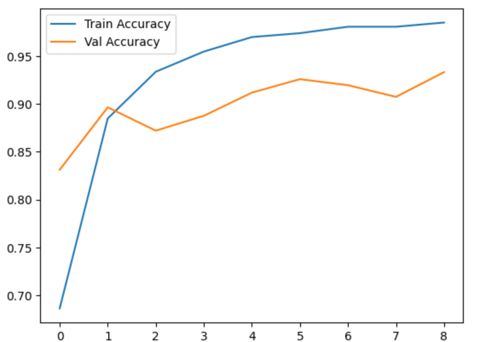
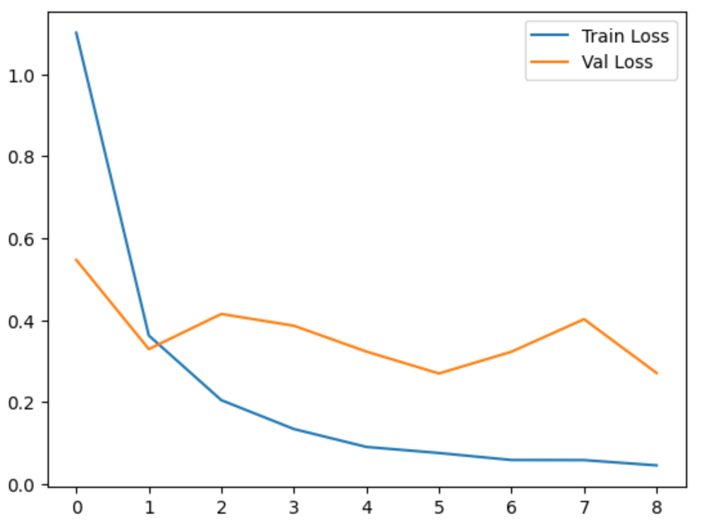
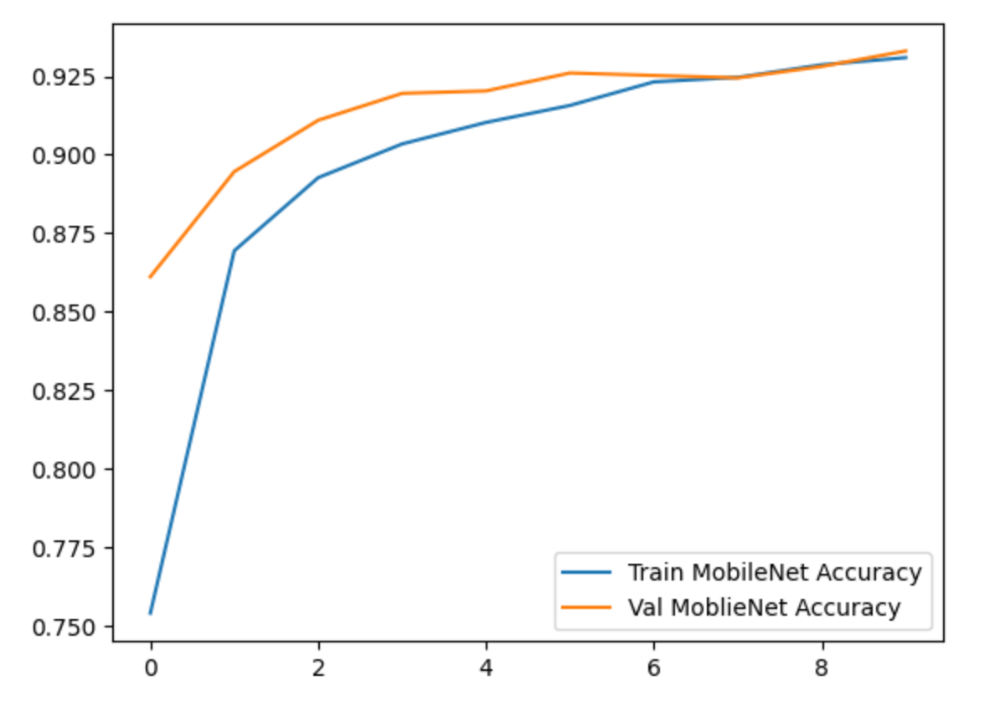
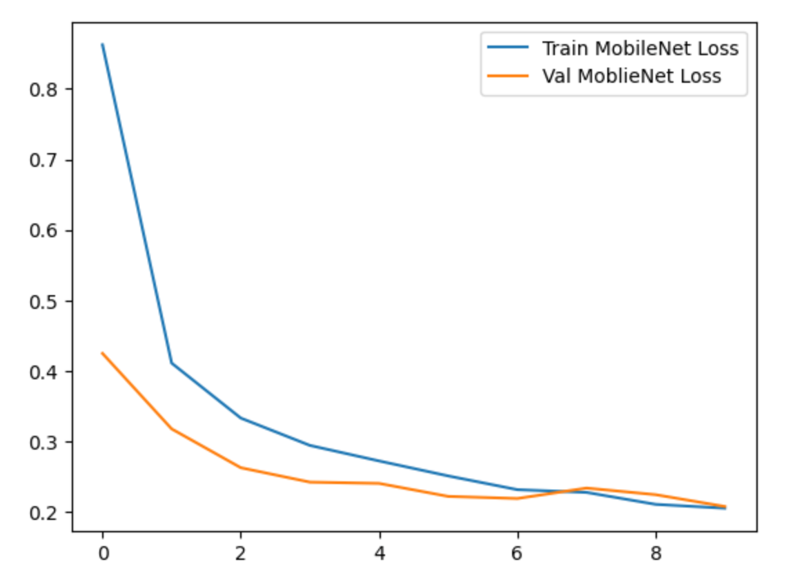
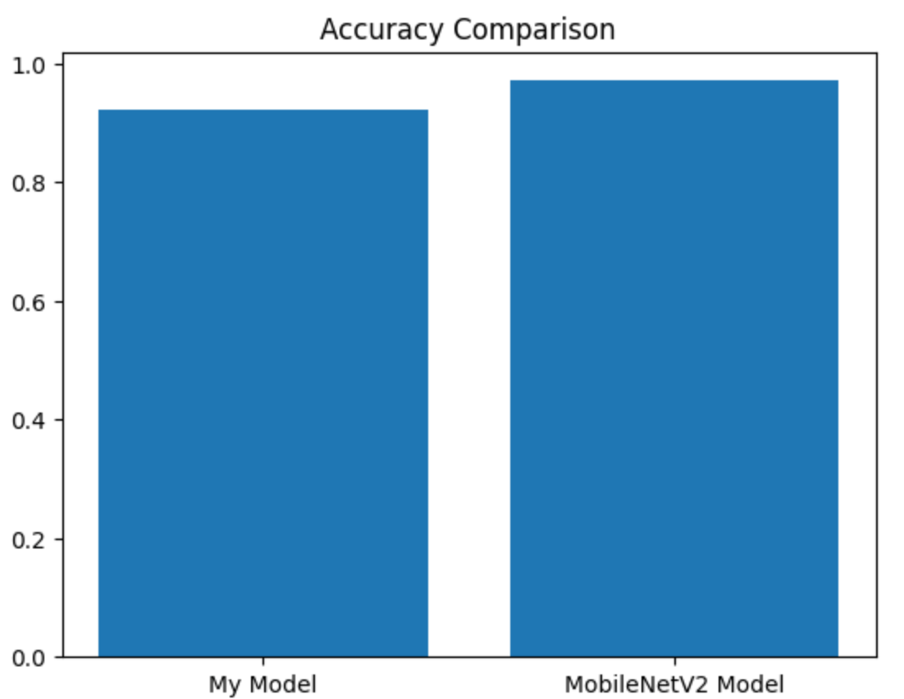
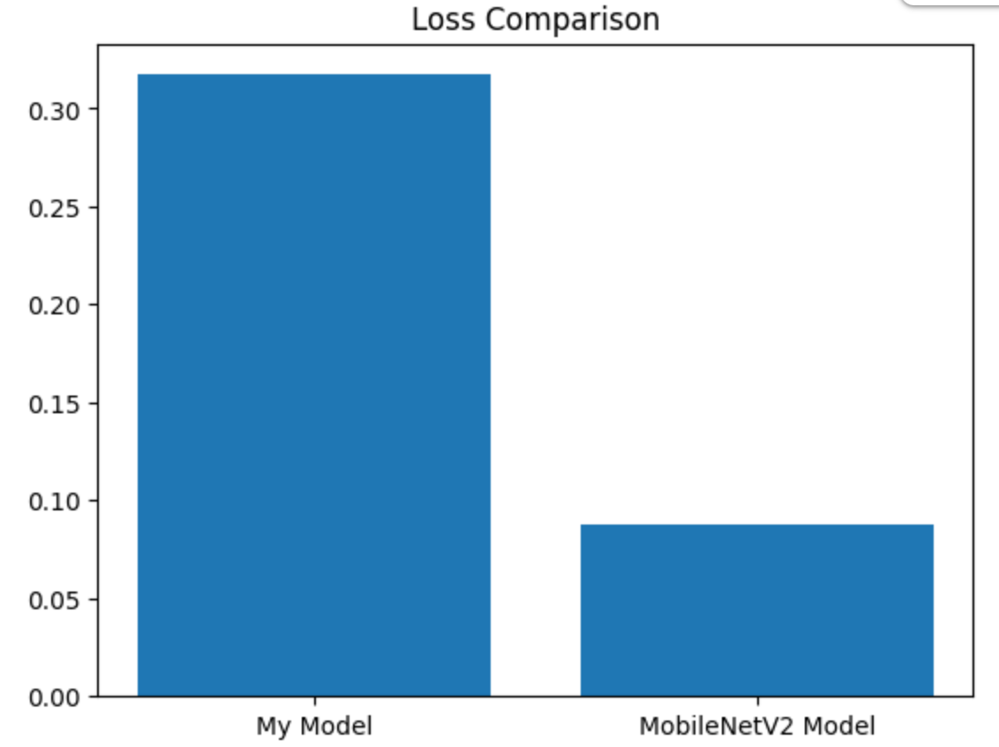

Link model của tôi: https://drive.google.com/file/d/1aQcnR1YKrybS9ZwYSTcgs5YL0SxKpcaS/view?usp=sharing

Link model MobileNet được train dựa trên dataset của tôi: [https://drive.google.com/file/d/1HW1ecxLbG7T18BTGEfX4Lqs-iR0RENOV/view?usp=sharing](https://drive.google.com/file/d/1yWEvDjnbW4ej93cZrlSm0MGpQsU43KC6/view?usp=sharing)

Link dataset: [https://drive.google.com/drive/folders/1O4uJAVRKYJvuZzI8usrUeZTEYqOL3xTo?usp=sharing](https://drive.google.com/drive/folders/1M_BtETkm2cS7phjRl0SKa8pgxd7xYN01?usp=sharing)

# Tìm hiểu và ứng dụng mạng nơ-ron tích chập (CNN) trong bài toán phân loại hình ảnh giống cây bệnh

## 1. Bối cảnh

Trong nông nghiệp, việc phát hiện sớm bệnh trên cây trồng bằng mắt thường thường mất thời gian và dễ nhầm lẫn giữa các loại bệnh có biểu hiện tương đồng. Dự án được thực hiện trong khuôn khổ môn Thực tập cơ sở tại Học viện Công nghệ Bưu chính Viễn thông, nhằm tìm hiểu kiến trúc mạng nơ-ron tích chập (CNN) và ứng dụng vào bài toán phân loại hình ảnh giống cây bệnh — hướng tới việc tự động hoá khâu chẩn đoán bệnh lý cây trồng dựa trên ảnh lá.

## 2. Phương pháp

Dự án được triển khai theo hai giai đoạn: nghiên cứu lý thuyết và thực nghiệm.

**Về lý thuyết**, nhóm tìm hiểu nền tảng Deep Learning, mạng nơ-ron nhân tạo, và đi sâu vào cấu trúc CNN gồm các lớp Convolutional (trích xuất đặc trưng), Pooling (giảm chiều dữ liệu, chống overfitting) và Fully Connected (phân loại cuối cùng).

**Về thực nghiệm**:
- **Dữ liệu**: sử dụng bộ dữ liệu công khai PlantVillage (Kaggle) với hơn 50.000 ảnh, thuộc 38 lớp (nhiều loại cây và loại bệnh khác nhau). Ảnh được resize về 150x150, chuẩn hoá pixel về [0,1], và chia theo tỉ lệ 80% training / 10% validation / 10% test.
- **Xây dựng mô hình CNN từ đầu** bằng Python, TensorFlow/Keras, theo kiến trúc: (Convolution + ReLU + Pooling) × 3 → Flatten → Dense → Output (Softmax, 38 lớp). Sử dụng optimizer Adam, hàm mất mát sparse categorical crossentropy, và kỹ thuật Early Stopping để tránh huấn luyện quá mức.
- **So sánh với mô hình pretrained MobileNetV2** (transfer learning, đóng băng trọng số gốc, chỉ huấn luyện thêm các lớp phân loại phía sau) nhằm đánh giá hiệu quả của việc tự thiết kế kiến trúc so với việc tận dụng mô hình đã huấn luyện sẵn trên ImageNet.

## 3. Kết quả

Mô hình CNN tự xây dựng đạt Training Accuracy khoảng 98–99%, trong khi Validation Accuracy đạt khoảng 92–94% và bắt đầu dao động từ epoch thứ 5, cho thấy dấu hiệu overfitting nhẹ — cơ chế Early Stopping đã giúp giữ lại bộ trọng số tốt nhất tại thời điểm này.

**Mô hình CNN tự xây:**

  
  

**Mô hình MobileNetV2 (pretrained):**

  
  

Có thể thấy đường Validation của mô hình tự xây dao động khá mạnh sau epoch 5, trong khi MobileNetV2 hội tụ mượt và ổn định hơn nhiều — hai đường train/val gần như bám sát nhau.

Trên tập test, kết quả so sánh giữa hai mô hình như sau:

| Mô hình | Loss | Accuracy |
|---|---|---|
| Mô hình CNN tự xây | 0.3172 | 92.07% |
| MobileNetV2 (pretrained) | 0.0876 | 97.06% |

  
  

MobileNetV2 cho kết quả vượt trội hơn về cả độ chính xác lẫn độ ổn định (khoảng cách giữa train/val accuracy gần như không đáng kể), nhờ đã được huấn luyện trước trên tập dữ liệu ImageNet lớn. Tuy vậy, mô hình CNN tự xây dựng — dù độ chính xác thấp hơn — vẫn đạt mức 92%, được đánh giá là chấp nhận được đối với một bài toán phân loại nhiều lớp có đặc trưng tương đồng, và mang lại giá trị học thuật lớn trong việc hiểu rõ cơ chế trích xuất đặc trưng của CNN.

## 4. Kết luận

Dự án đã đạt được mục tiêu đề ra là xây dựng một hệ thống nhận diện và phân loại bệnh lý cây trồng dựa trên hình ảnh. Việc tự thiết kế kiến trúc CNN thay vì dùng ngay mô hình pretrained giúp nhóm hiểu sâu cách các bộ lọc trích xuất đặc trưng hình ảnh qua từng lớp. Kết quả so sánh với MobileNetV2 cho thấy mô hình tự xây tuy chưa đạt độ chính xác và độ ổn định cao bằng mô hình pretrained, nhưng vẫn học được các đặc trưng hữu ích và đưa ra kết quả phân loại tốt. Qua quá trình thực hiện, nhóm rút ra bài học rằng sự đa dạng của dữ liệu đầu vào có vai trò quan trọng hơn việc chỉ tăng độ sâu của mạng.

## 5. Kiến nghị

- Tối ưu hoá siêu tham số, kết hợp cơ chế tự động điều chỉnh tốc độ học (Learning Rate Scheduler) khi hàm mất mát đi vào vùng bão hoà
- Mở rộng dữ liệu sang thêm nhiều loại cây trồng khác để tăng khả năng ứng dụng thực tế
- Cải thiện khả năng xử lý ảnh độ phân giải cao hơn, ví dụ bằng kỹ thuật Depthwise Separable Convolution
- Triển khai mô hình dưới dạng TensorFlow Lite để đóng gói thành ứng dụng di động, hỗ trợ nông dân quét lá bệnh trực tiếp tại đồng ruộng
- Kết hợp thêm dữ liệu cảm biến IoT (nhiệt độ, độ ẩm) để hỗ trợ dự báo nguy cơ bùng phát dịch bệnh
- Phát triển thêm hệ thống khuyến nghị giải pháp xử lý (thuốc bảo vệ thực vật, biện pháp sinh học) dựa trên loại bệnh đã nhận diện được
